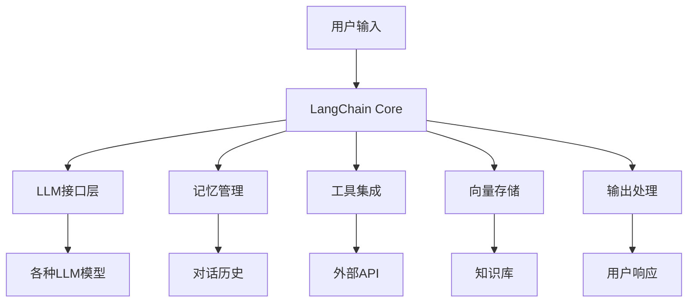

# LangChain 详细解释

> **项目名称**: LangChain  
> **GitHub**: [langchain-ai/langchain](https://github.com/langchain-ai/langchain)  
> **官方文档**: [docs.langchain.com](https://docs.langchain.com/)  
> **许可证**: MIT License  
> **主要语言**: Python, JavaScript/TypeScript  

---

## 🎯 项目概述

### 项目简介
LangChain是一个用于开发由语言模型驱动的应用程序的框架。它提供了构建复杂AI应用的模块化组件，包括链式调用、记忆管理、工具集成等核心功能。

### 核心功能
- **链式调用**: 将多个LLM调用组合成复杂的推理链
- **记忆管理**: 实现对话历史和上下文管理
- **工具集成**: 集成外部工具和API
- **向量存储**: 支持多种向量数据库
- **代理系统**: 构建自主AI代理

### 技术栈
- **后端**: Python 3.8+, Node.js 18+
- **AI模型**: 支持OpenAI、Anthropic、Hugging Face等
- **向量数据库**: Pinecone、Weaviate、Chroma、FAISS等
- **框架**: FastAPI、Streamlit、Gradio等

---

## 🏗️ 技术架构

### 整体架构


### 核心组件

#### 1. LangChain Core
- **基础组件**: 提供核心的抽象和接口
- **可观测性**: 内置的日志和追踪功能
- **流式处理**: 支持流式输出和实时响应

#### 2. LangChain Community
- **集成组件**: 与第三方服务的集成
- **工具库**: 丰富的预构建工具
- **适配器**: 各种数据源和服务的适配器

#### 3. LangChain LangGraph
- **图式编排**: 基于图的复杂工作流编排
- **状态管理**: 复杂状态的管理和转换
- **并行处理**: 支持并行任务执行

---

## ⚡ 功能特性

### 核心功能模块

#### 1. 链式调用 (Chains)
```python
from langchain import LLMChain, PromptTemplate
from langchain.llms import OpenAI

# 创建提示模板
prompt = PromptTemplate(
    input_variables=["product"],
    template="What is a good name for a company that makes {product}?"
)

# 创建LLM链
llm = OpenAI(temperature=0.9)
chain = LLMChain(llm=llm, prompt=prompt)

# 执行链
result = chain.run("colorful socks")
print(result)  # 输出: "Rainbow Sock Co."
```

#### 2. 记忆管理 (Memory)
```python
from langchain.memory import ConversationBufferMemory
from langchain.chains import ConversationChain

# 创建带记忆的对话链
memory = ConversationBufferMemory()
conversation = ConversationChain(
    llm=llm,
    memory=memory,
    verbose=True
)

# 对话会自动保存到记忆中
conversation.predict(input="Hi there!")
conversation.predict(input="I'm doing well! Just having a conversation with an AI.")
conversation.predict(input="What was the first thing I said to you?")
```

#### 3. 工具集成 (Tools)
```python
from langchain.tools import DuckDuckGoSearchRun
from langchain.agents import initialize_agent, AgentType

# 创建搜索工具
search = DuckDuckGoSearchRun()

# 初始化代理
agent = initialize_agent(
    [search], 
    llm, 
    agent=AgentType.ZERO_SHOT_REACT_DESCRIPTION,
    verbose=True
)

# 使用工具
agent.run("What is the latest news about AI?")
```

#### 4. 向量存储 (Vector Stores)
```python
from langchain.embeddings import OpenAIEmbeddings
from langchain.vectorstores import Chroma
from langchain.text_splitter import CharacterTextSplitter

# 创建文本分割器
text_splitter = CharacterTextSplitter(chunk_size=1000, chunk_overlap=0)
texts = text_splitter.split_documents(documents)

# 创建向量存储
embeddings = OpenAIEmbeddings()
db = Chroma.from_documents(texts, embeddings)

# 相似性搜索
query = "What is machine learning?"
docs = db.similarity_search(query)
```

### 高级特性

#### 1. 流式处理
```python
from langchain.callbacks.streaming_stdout import StreamingStdOutCallbackHandler

# 创建流式LLM
streaming_llm = OpenAI(
    streaming=True,
    callbacks=[StreamingStdOutCallbackHandler()],
    temperature=0
)

# 流式输出
streaming_llm("Tell me a story about a robot.")
```

#### 2. 自定义工具
```python
from langchain.tools import BaseTool
from typing import Optional

class CustomCalculatorTool(BaseTool):
    name = "calculator"
    description = "Useful for when you need to answer questions about math"
    
    def _run(self, query: str) -> str:
        """Use the tool."""
        try:
            return str(eval(query))
        except:
            return "I cannot calculate this expression."
    
    async def _arun(self, query: str) -> str:
        """Use the tool asynchronously."""
        return self._run(query)

# 使用自定义工具
agent = initialize_agent([CustomCalculatorTool()], llm, verbose=True)
agent.run("What is 15 * 27?")
```

---

## 🔧 技术实现

### 核心算法原理

#### 1. 链式调用机制
- **顺序执行**: 按预定义顺序执行多个LLM调用
- **条件分支**: 根据条件选择不同的执行路径
- **并行处理**: 支持并行执行多个任务
- **错误处理**: 内置的错误处理和重试机制

#### 2. 记忆管理策略
- **对话历史**: 保存完整的对话上下文
- **摘要记忆**: 自动生成对话摘要以节省token
- **实体记忆**: 提取和记忆关键实体信息
- **知识图谱**: 构建结构化的知识表示

#### 3. 向量检索算法
- **相似性计算**: 使用余弦相似度、欧几里得距离等
- **索引优化**: 支持多种向量索引算法
- **混合检索**: 结合关键词和语义检索
- **重排序**: 基于相关性对结果进行重排序

### 模型选择策略

#### 1. LLM选择
- **性能考虑**: 根据任务复杂度选择合适模型
- **成本优化**: 平衡性能和API调用成本
- **功能需求**: 选择支持特定功能的模型
- **本地部署**: 支持本地部署的开源模型

#### 2. 嵌入模型
- **多语言支持**: 支持多种语言的嵌入模型
- **领域适应**: 针对特定领域优化的嵌入模型
- **性能对比**: 不同嵌入模型的性能对比
- **成本效益**: 平衡质量和成本的模型选择

---

## 🚀 部署使用

### 安装部署

#### 1. Python环境安装
```bash
# 安装LangChain
pip install langchain

# 安装特定组件
pip install langchain-community
pip install langchain-core
pip install langgraph

# 安装依赖
pip install openai
pip install chromadb
pip install tiktoken
```

#### 2. JavaScript/TypeScript安装
```bash
# 安装LangChain.js
npm install langchain

# 安装特定组件
npm install @langchain/core
npm install @langchain/community
npm install @langchain/openai
```

#### 3. 环境配置
```bash
# 设置环境变量
export OPENAI_API_KEY="your-api-key"
export ANTHROPIC_API_KEY="your-api-key"
export PINECONE_API_KEY="your-api-key"
```

### 配置说明

#### 1. 基础配置
```python
import os
from langchain.llms import OpenAI

# 配置API密钥
os.environ["OPENAI_API_KEY"] = "your-api-key"

# 配置LLM参数
llm = OpenAI(
    temperature=0.7,
    max_tokens=1000,
    model_name="gpt-3.5-turbo"
)
```

#### 2. 高级配置
```python
from langchain.callbacks import FileCallbackHandler

# 配置回调处理器
handler = FileCallbackHandler("langchain.log")
llm = OpenAI(callbacks=[handler])

# 配置缓存
from langchain.cache import InMemoryCache
langchain.cache = InMemoryCache()
```

### 使用示例

#### 1. 基础问答应用
```python
from langchain import LLMChain, PromptTemplate
from langchain.llms import OpenAI

# 创建问答链
template = """Question: {question}

Answer: Let's think about this step by step:"""

prompt = PromptTemplate(template=template, input_variables=["question"])
llm_chain = LLMChain(prompt=prompt, llm=OpenAI(temperature=0))

# 使用链
question = "What is the capital of France?"
answer = llm_chain.run(question)
print(answer)
```

#### 2. 文档问答系统
```python
from langchain.document_loaders import TextLoader
from langchain.text_splitter import CharacterTextSplitter
from langchain.embeddings import OpenAIEmbeddings
from langchain.vectorstores import Chroma
from langchain.chains import RetrievalQA

# 加载文档
loader = TextLoader("data.txt")
documents = loader.load()

# 分割文档
text_splitter = CharacterTextSplitter(chunk_size=1000, chunk_overlap=0)
texts = text_splitter.split_documents(documents)

# 创建向量存储
embeddings = OpenAIEmbeddings()
docsearch = Chroma.from_documents(texts, embeddings)

# 创建问答链
qa_chain = RetrievalQA.from_chain_type(
    llm=OpenAI(),
    chain_type="stuff",
    retriever=docsearch.as_retriever()
)

# 提问
query = "What is the main topic of the document?"
result = qa_chain.run(query)
print(result)
```

#### 3. 智能代理系统
```python
from langchain.agents import initialize_agent, Tool
from langchain.tools import DuckDuckGoSearchRun
from langchain.llms import OpenAI

# 定义工具
search = DuckDuckGoSearchRun()
tools = [
    Tool(
        name="Search",
        func=search.run,
        description="useful for when you need to answer questions about current events"
    )
]

# 初始化代理
agent = initialize_agent(
    tools, 
    OpenAI(temperature=0), 
    agent="zero-shot-react-description",
    verbose=True
)

# 使用代理
agent.run("What are the latest developments in renewable energy?")
```

### 故障排除

#### 1. 常见问题
- **API密钥错误**: 检查环境变量设置
- **依赖缺失**: 安装所需的依赖包
- **版本兼容**: 确保LangChain版本兼容性
- **内存不足**: 优化向量存储和文档分割

#### 2. 性能优化
- **批量处理**: 使用批量API调用减少延迟
- **缓存策略**: 启用结果缓存避免重复计算
- **异步处理**: 使用异步API提高并发性能
- **模型选择**: 根据任务选择合适大小的模型

---

## 📊 项目评价

### 优势特点

#### 1. 功能完整性
- **模块化设计**: 提供完整的AI应用开发组件
- **丰富的集成**: 支持多种LLM、数据库、工具
- **灵活配置**: 高度可配置的组件和参数

#### 2. 易用性
- **Python优先**: 优秀的Python API设计
- **文档完善**: 详细的官方文档和示例
- **社区活跃**: 活跃的开源社区支持

#### 3. 扩展性
- **插件系统**: 支持自定义工具和组件
- **框架集成**: 与主流Web框架无缝集成
- **云原生**: 支持云部署和扩展

### 不足之处

#### 1. 学习曲线
- **概念复杂**: 需要理解多个抽象概念
- **配置复杂**: 高级功能的配置相对复杂
- **调试困难**: 复杂链的调试和优化困难

#### 2. 性能限制
- **延迟问题**: 复杂链可能产生较高延迟
- **资源消耗**: 向量存储和嵌入计算资源密集
- **扩展性**: 大规模部署的扩展性挑战

#### 3. 稳定性
- **版本变化**: API变化可能影响现有代码
- **依赖管理**: 复杂的依赖关系管理
- **错误处理**: 错误处理和恢复机制有限

### 适用场景

#### 1. 最佳适用
- **原型开发**: 快速构建AI应用原型
- **研究实验**: AI研究和实验平台
- **中小型应用**: 中小规模的AI应用
- **教育学习**: AI开发学习和教学

#### 2. 谨慎使用
- **生产环境**: 需要充分测试和优化
- **大规模部署**: 考虑性能和扩展性
- **实时应用**: 延迟敏感的应用场景
- **关键业务**: 业务关键型应用

### 改进建议

#### 1. 短期改进
- **性能优化**: 优化核心组件的性能
- **错误处理**: 改进错误处理和恢复机制
- **文档完善**: 补充更多实际应用示例
- **测试覆盖**: 提高测试覆盖率和质量

#### 2. 长期发展
- **架构重构**: 考虑微服务架构重构
- **云原生**: 增强云原生部署能力
- **企业版**: 开发企业级功能和服务
- **生态建设**: 建设更完善的工具生态

---

## 🔗 相关资源

### 官方资源
- [LangChain官方文档](https://docs.langchain.com/)
- [LangChain GitHub仓库](https://github.com/langchain-ai/langchain)
- [LangChain Discord社区](https://discord.gg/langchain)
- [LangChain博客](https://blog.langchain.dev/)

### 学习资源
- [LangChain教程](https://python.langchain.com/docs/tutorials/)
- [LangChain示例](https://github.com/langchain-ai/langchain/tree/master/examples)
- [LangChain Cookbook](https://python.langchain.com/docs/use_cases/)

### 社区资源
- [LangChain Reddit](https://www.reddit.com/r/LangChain/)
- [LangChain Stack Overflow](https://stackoverflow.com/questions/tagged/langchain)
- [LangChain YouTube频道](https://www.youtube.com/@LangChain)

---

*本解释基于LangChain最新版本编写，具体功能可能随版本更新而变化。建议参考官方文档获取最新信息。*
