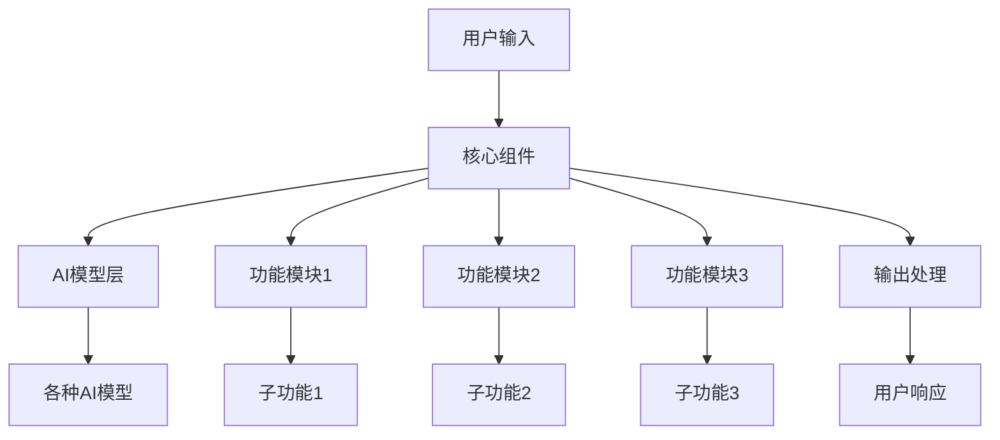

# [项目名称] 详细解释

> **项目名称**: [项目名称]  
> **GitHub**: [GitHub链接]  
> **官方文档**: [官方文档链接]  
> **许可证**: [许可证类型]  
> **主要语言**: [主要编程语言]  

---

## 🎯 项目概述

### 项目简介
[项目的基本介绍，包括项目定位、主要用途等]

### 核心功能
- **[功能1]**: [功能描述]
- **[功能2]**: [功能描述]
- **[功能3]**: [功能描述]
- **[功能4]**: [功能描述]
- **[功能5]**: [功能描述]

### 技术栈
- **后端**: [后端技术]
- **AI模型**: [支持的AI模型]
- **数据库**: [使用的数据库]
- **框架**: [使用的框架]

---

## 🏗️ 技术架构

### 整体架构


### 核心组件

#### 1. [组件1]
- **功能**: [组件功能描述]
- **特点**: [组件特点]
- **接口**: [提供的接口]

#### 2. [组件2]
- **功能**: [组件功能描述]
- **特点**: [组件特点]
- **接口**: [提供的接口]

#### 3. [组件3]
- **功能**: [组件功能描述]
- **特点**: [组件特点]
- **接口**: [提供的接口]

---

## ⚡ 功能特性

### 核心功能模块

#### 1. [功能模块1]
```[代码语言]
[代码示例]
```

#### 2. [功能模块2]
```[代码语言]
[代码示例]
```

#### 3. [功能模块3]
```[代码语言]
[代码示例]
```

#### 4. [功能模块4]
```[代码语言]
[代码示例]
```

### 高级特性

#### 1. [高级特性1]
```[代码语言]
[代码示例]
```

#### 2. [高级特性2]
```[代码语言]
[代码示例]
```

---

## 🔧 技术实现

### 核心算法原理

#### 1. [算法1]
- **原理**: [算法原理描述]
- **实现**: [实现方式]
- **优化**: [优化策略]

#### 2. [算法2]
- **原理**: [算法原理描述]
- **实现**: [实现方式]
- **优化**: [优化策略]

#### 3. [算法3]
- **原理**: [算法原理描述]
- **实现**: [实现方式]
- **优化**: [优化策略]

### 技术选择策略

#### 1. [技术选择1]
- **考虑因素**: [选择考虑的因素]
- **对比分析**: [与其他技术的对比]
- **适用场景**: [适用的场景]

#### 2. [技术选择2]
- **考虑因素**: [选择考虑的因素]
- **对比分析**: [与其他技术的对比]
- **适用场景**: [适用的场景]

---

## 🚀 部署使用

### 安装部署

#### 1. [环境1]安装
```bash
[安装命令]
```

#### 2. [环境2]安装
```bash
[安装命令]
```

#### 3. 环境配置
```bash
[配置命令]
```

### 配置说明

#### 1. 基础配置
```[代码语言]
[配置代码]
```

#### 2. 高级配置
```[代码语言]
[配置代码]
```

### 使用示例

#### 1. [示例1]
```[代码语言]
[代码示例]
```

#### 2. [示例2]
```[代码语言]
[代码示例]
```

#### 3. [示例3]
```[代码语言]
[代码示例]
```

### 故障排除

#### 1. 常见问题
- **[问题1]**: [解决方案]
- **[问题2]**: [解决方案]
- **[问题3]**: [解决方案]
- **[问题4]**: [解决方案]

#### 2. 性能优化
- **[优化1]**: [优化方法]
- **[优化2]**: [优化方法]
- **[优化3]**: [优化方法]
- **[优化4]**: [优化方法]

---

## 📊 项目评价

### 优势特点

#### 1. [优势类别1]
- **[优势1]**: [具体描述]
- **[优势2]**: [具体描述]
- **[优势3]**: [具体描述]

#### 2. [优势类别2]
- **[优势1]**: [具体描述]
- **[优势2]**: [具体描述]
- **[优势3]**: [具体描述]

#### 3. [优势类别3]
- **[优势1]**: [具体描述]
- **[优势2]**: [具体描述]
- **[优势3]**: [具体描述]

### 不足之处

#### 1. [不足类别1]
- **[不足1]**: [具体描述]
- **[不足2]**: [具体描述]
- **[不足3]**: [具体描述]

#### 2. [不足类别2]
- **[不足1]**: [具体描述]
- **[不足2]**: [具体描述]
- **[不足3]**: [具体描述]

#### 3. [不足类别3]
- **[不足1]**: [具体描述]
- **[不足2]**: [具体描述]
- **[不足3]**: [具体描述]

### 适用场景

#### 1. 最佳适用
- **[场景1]**: [适用描述]
- **[场景2]**: [适用描述]
- **[场景3]**: [适用描述]
- **[场景4]**: [适用描述]

#### 2. 谨慎使用
- **[场景1]**: [谨慎原因]
- **[场景2]**: [谨慎原因]
- **[场景3]**: [谨慎原因]
- **[场景4]**: [谨慎原因]

### 改进建议

#### 1. 短期改进
- **[改进1]**: [具体建议]
- **[改进2]**: [具体建议]
- **[改进3]**: [具体建议]
- **[改进4]**: [具体建议]

#### 2. 长期发展
- **[发展1]**: [发展方向]
- **[发展2]**: [发展方向]
- **[发展3]**: [发展方向]
- **[发展4]**: [发展方向]

---

## 🔗 相关资源

### 官方资源
- [[项目名称]官方文档]([文档链接])
- [[项目名称] GitHub仓库]([GitHub链接])
- [[项目名称]社区]([社区链接])
- [[项目名称]博客]([博客链接])

### 学习资源
- [[项目名称]教程]([教程链接])
- [[项目名称]示例]([示例链接])
- [[项目名称] Cookbook]([Cookbook链接])

### 社区资源
- [[项目名称] Reddit]([Reddit链接])
- [[项目名称] Stack Overflow]([Stack Overflow链接])
- [[项目名称] YouTube频道]([YouTube链接])

---

*本解释基于[项目名称]最新版本编写，具体功能可能随版本更新而变化。建议参考官方文档获取最新信息。*

---

## 📝 使用说明

### 如何填写模板

1. **替换方括号内容**: 将所有的`[内容]`替换为实际信息
2. **调整图表数据**: 根据实际情况修改mermaid图表
3. **补充具体分析**: 在分析部分添加具体的分析内容
4. **更新技术细节**: 使用最新的技术信息
5. **调整评价建议**: 根据分析结果给出合理的评价

### 注意事项

- 确保所有信息准确可靠
- 保持分析的客观性
- 定期更新项目信息
- 遵循统一的格式标准
- 包含实际的代码示例
