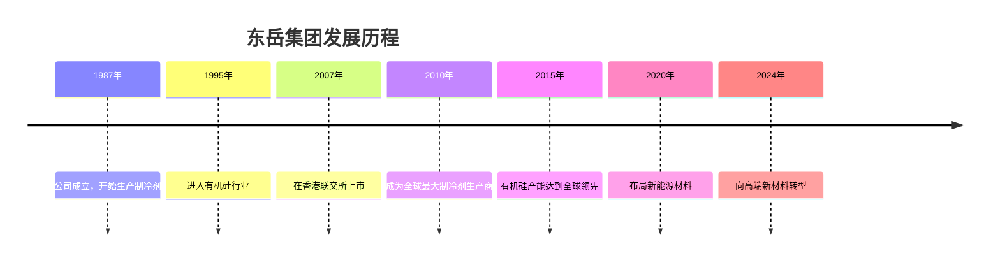
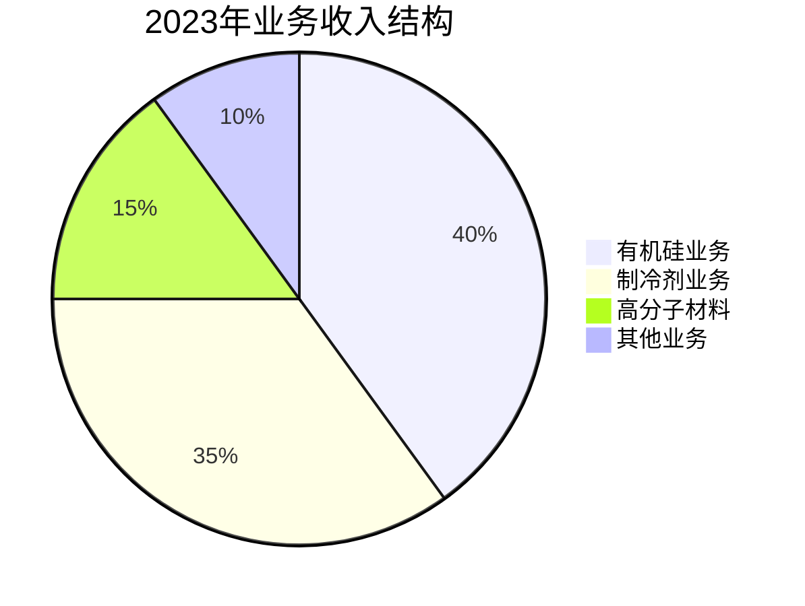
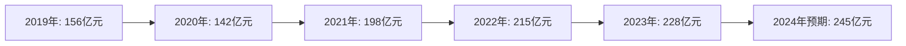
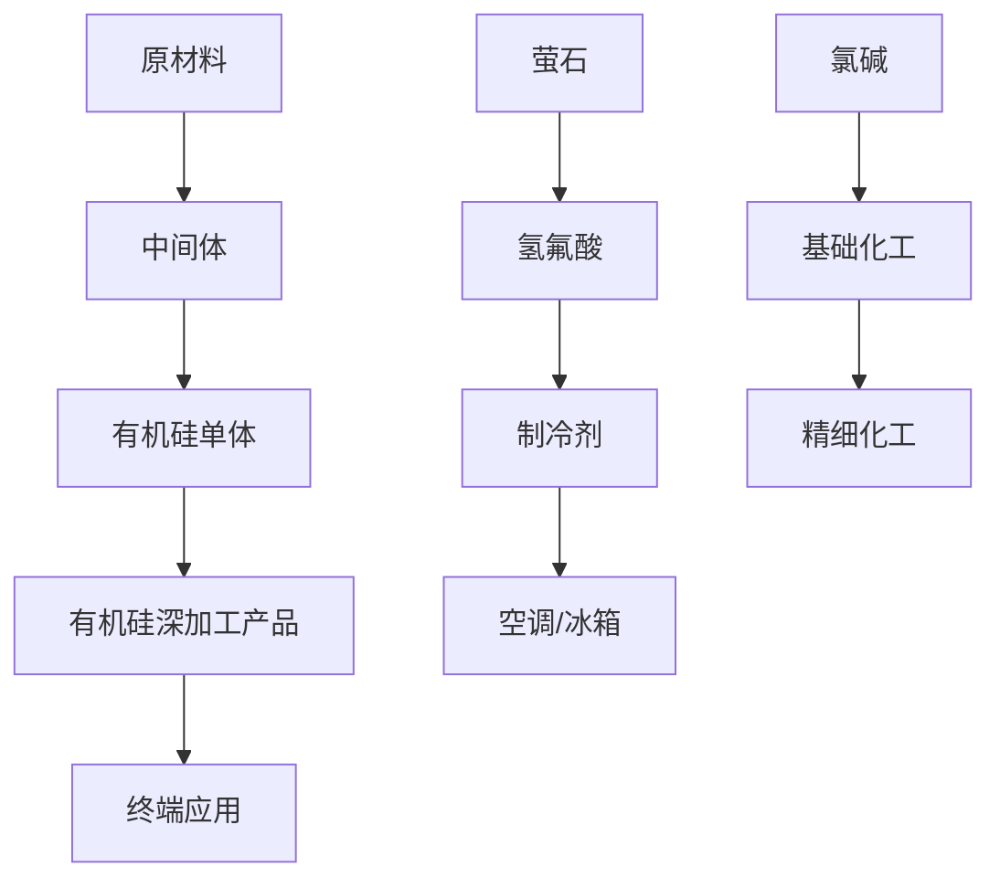

# 东岳集团 (Dongyue Group) 公司分析报告

> **报告日期**: 2024年12月  
> **分析师**: AI Research Team  
> **公司代码**: 0189.HK (港股)  
> **行业分类**: 化工新材料  

---

## 📊 公司概览

### 基本信息
- **公司名称**: 东岳集团有限公司
- **英文名称**: Dongyue Group Limited
- **成立时间**: 1987年
- **总部地址**: 山东省淄博市桓台县
- **主营业务**: 有机硅、制冷剂、高分子材料等化工产品
- **员工人数**: 约12,000人

### 发展历程

---

## 🏭 业务结构分析

### 核心业务板块

#### 1. 有机硅业务 (40%)
- **产品类型**: 有机硅单体、硅橡胶、硅油、硅树脂
- **应用领域**: 建筑、汽车、电子、医疗、新能源
- **市场地位**: 全球领先的有机硅生产商
- **技术优势**: 拥有完整的有机硅产业链

#### 2. 制冷剂业务 (35%)
- **产品类型**: R22、R32、R125、R134a等
- **应用领域**: 空调、冰箱、汽车空调
- **市场地位**: 全球最大制冷剂生产商
- **环保优势**: 积极布局环保型制冷剂

#### 3. 高分子材料 (15%)
- **产品类型**: 聚四氟乙烯(PTFE)、聚偏氟乙烯(PVDF)
- **应用领域**: 化工、电子、新能源
- **发展前景**: 受益于新能源产业发展

#### 4. 其他业务 (10%)
- **产品类型**: 氯碱、氟化工等
- **应用领域**: 基础化工、精细化工

### 业务分布图

---

## 💰 财务分析

### 收入增长趋势

### 关键财务指标

| 指标 | 2023年 | 2022年 | 2021年 | 同比增长 |
|------|--------|--------|--------|----------|
| 营业收入(亿元) | 228.5 | 215.2 | 198.3 | +6.2% |
| 净利润(亿元) | 18.6 | 16.8 | 15.2 | +10.7% |
| 毛利率(%) | 22.3 | 21.8 | 20.1 | +0.5% |
| 净利率(%) | 8.1 | 7.8 | 7.7 | +0.3% |
| 资产负债率(%) | 58.2 | 59.1 | 61.3 | -0.9% |

### 盈利能力分析
- **毛利率提升**: 受益于产品结构优化和成本控制
- **净利率改善**: 规模效应显现，费用率下降
- **现金流状况**: 经营现金流充裕，投资活动活跃

---

## 🎯 竞争优势分析

### 1. 技术优势
- **研发投入**: 年研发投入占收入比重3-4%
- **专利数量**: 拥有有效专利800余项
- **技术团队**: 博士、硕士等高层次人才占比15%
- **产学研合作**: 与清华大学、中科院等机构深度合作

### 2. 产业链优势

### 3. 规模优势
- **产能规模**: 有机硅单体产能全球第一
- **成本优势**: 规模效应显著，单位成本持续下降
- **市场地位**: 在多个细分领域占据领先地位

### 4. 客户优势
- **客户结构**: 覆盖全球500强企业
- **长期合作**: 与主要客户建立10年以上合作关系
- **服务能力**: 提供从研发到应用的全方位服务

---

## 🌍 市场分析

### 全球市场格局

#### 有机硅市场
- **市场规模**: 全球约200亿美元，年增长率5-7%
- **主要玩家**: 东岳集团、道康宁、瓦克化学、信越化学
- **东岳份额**: 全球约15%，中国约30%

#### 制冷剂市场
- **市场规模**: 全球约50亿美元，年增长率3-5%
- **环保趋势**: 逐步淘汰高GWP制冷剂
- **东岳份额**: 全球约25%，中国约40%

### 中国市场机遇
- **政策支持**: "双碳"目标推动绿色化工发展
- **产业升级**: 高端制造业对新材料需求增长
- **新能源**: 光伏、风电、新能源汽车带动需求

---

## ⚠️ 风险分析

### 1. 行业风险
- **周期性波动**: 化工行业具有明显的周期性特征
- **环保政策**: 环保要求趋严，可能增加成本
- **技术变革**: 新技术可能颠覆现有产品

### 2. 经营风险
- **原材料价格**: 主要原材料价格波动影响成本
- **汇率风险**: 出口业务受汇率波动影响
- **产能过剩**: 行业扩产可能导致价格竞争

### 3. 财务风险
- **债务水平**: 资产负债率相对较高
- **现金流**: 投资活动对现金流要求较高
- **汇率风险**: 外币债务和收入存在汇率风险

---

## 🚀 发展战略

### 短期目标 (1-2年)
- **产能扩张**: 有机硅产能提升至100万吨/年
- **产品升级**: 提高高端产品占比至60%
- **市场拓展**: 深化海外市场布局

### 中期目标 (3-5年)
- **技术创新**: 在新能源材料领域取得突破
- **产业链延伸**: 向下游高附加值产品延伸
- **国际化**: 成为全球化工新材料领导者

### 长期愿景 (5-10年)
- **技术领先**: 在关键材料领域实现技术突破
- **绿色发展**: 成为绿色化工的标杆企业
- **全球布局**: 建立全球化的研发、生产和销售网络

---

## 📈 投资建议

### 投资亮点
1. **行业龙头**: 在多个细分领域占据领先地位
2. **技术优势**: 拥有完整的产业链和核心技术
3. **成长性**: 受益于新能源和高端制造业发展
4. **估值合理**: 当前估值处于历史合理区间

### 投资风险
1. **行业周期性**: 化工行业波动性较大
2. **环保压力**: 环保要求可能影响盈利能力
3. **竞争加剧**: 行业竞争可能进一步加剧

### 投资评级
- **短期**: 中性 (3-6个月)
- **中期**: 增持 (6-12个月)
- **长期**: 买入 (1-3年)

---

## 📚 参考资料

1. 东岳集团2023年年报
2. 东岳集团投资者关系网站
3. 行业研究报告
4. 公司公告和新闻

---

*本报告基于公开信息编制，仅供参考，不构成投资建议。投资有风险，入市需谨慎。* 