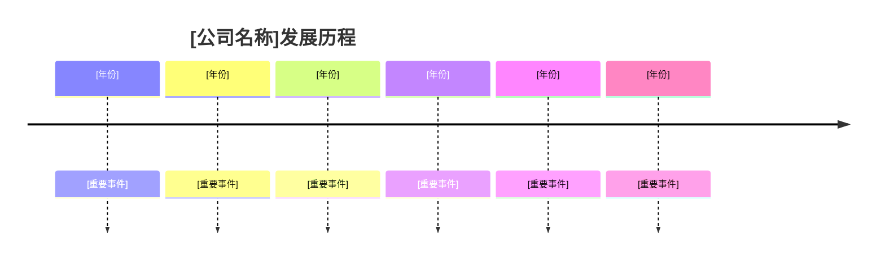
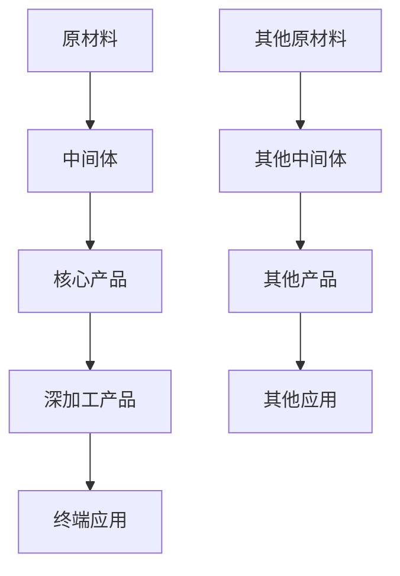

# [公司名称] 公司分析报告

> **报告日期**: [YYYY年MM月]  
> **分析师**: [分析师姓名]  
> **公司代码**: [股票代码]  
> **行业分类**: [所属行业]  

---

## 📊 公司概览

### 基本信息
- **公司名称**: [公司全称]
- **英文名称**: [英文名称]
- **成立时间**: [成立年份]
- **总部地址**: [总部所在地]
- **主营业务**: [主要业务描述]
- **员工人数**: [员工数量]

### 发展历程


---

## 🏭 业务结构分析

### 核心业务板块

#### 1. [业务板块1] ([收入占比]%)
- **产品类型**: [产品描述]
- **应用领域**: [应用领域]
- **市场地位**: [市场地位]
- **技术优势**: [技术优势]

#### 2. [业务板块2] ([收入占比]%)
- **产品类型**: [产品描述]
- **应用领域**: [应用领域]
- **市场地位**: [市场地位]
- **技术优势**: [技术优势]

#### 3. [业务板块3] ([收入占比]%)
- **产品类型**: [产品描述]
- **应用领域**: [应用领域]
- **市场地位**: [市场地位]
- **发展前景**: [发展前景]

#### 4. [其他业务] ([收入占比]%)
- **产品类型**: [产品描述]
- **应用领域**: [应用领域]

### 业务分布图


---

## 💰 财务分析

### 收入增长趋势
```mermaid
graph LR
    A[[年份]: [金额]] --> B[[年份]: [金额]]
    B --> C[[年份]: [金额]]
    C --> D[[年份]: [金额]]
    D --> E[[年份]: [金额]]
    E --> F[[年份]预期: [金额]]
```

### 关键财务指标

| 指标 | [年份]年 | [年份]年 | [年份]年 | 同比增长 |
|------|----------|----------|----------|----------|
| 营业收入(亿元) | [数值] | [数值] | [数值] | [增长率] |
| 净利润(亿元) | [数值] | [数值] | [数值] | [增长率] |
| 毛利率(%) | [数值] | [数值] | [数值] | [变化] |
| 净利率(%) | [数值] | [数值] | [数值] | [变化] |
| 资产负债率(%) | [数值] | [数值] | [数值] | [变化] |

### 盈利能力分析
- **毛利率变化**: [分析说明]
- **净利率变化**: [分析说明]
- **现金流状况**: [分析说明]

---

## 🎯 竞争优势分析

### 1. 技术优势
- **研发投入**: [研发投入情况]
- **专利数量**: [专利数量]
- **技术团队**: [技术团队情况]
- **产学研合作**: [合作情况]

### 2. 产业链优势


### 3. 规模优势
- **产能规模**: [规模描述]
- **成本优势**: [成本优势]
- **市场地位**: [市场地位]

### 4. 客户优势
- **客户结构**: [客户结构]
- **长期合作**: [合作情况]
- **服务能力**: [服务能力]

---

## 🌍 市场分析

### 全球市场格局

#### [细分市场1]
- **市场规模**: [市场规模]
- **主要玩家**: [主要竞争者]
- **[公司名称]份额**: [市场份额]

#### [细分市场2]
- **市场规模**: [市场规模]
- **主要玩家**: [主要竞争者]
- **[公司名称]份额**: [市场份额]

### 中国市场机遇
- **政策支持**: [政策支持]
- **产业升级**: [产业升级]
- **新兴需求**: [新兴需求]

---

## ⚠️ 风险分析

### 1. 行业风险
- **周期性波动**: [风险描述]
- **政策变化**: [风险描述]
- **技术变革**: [风险描述]

### 2. 经营风险
- **原材料价格**: [风险描述]
- **汇率风险**: [风险描述]
- **竞争加剧**: [风险描述]

### 3. 财务风险
- **债务水平**: [风险描述]
- **现金流**: [风险描述]
- **汇率风险**: [风险描述]

---

## 🚀 发展战略

### 短期目标 (1-2年)
- **目标1**: [具体描述]
- **目标2**: [具体描述]
- **目标3**: [具体描述]

### 中期目标 (3-5年)
- **目标1**: [具体描述]
- **目标2**: [具体描述]
- **目标3**: [具体描述]

### 长期愿景 (5-10年)
- **愿景1**: [具体描述]
- **愿景2**: [具体描述]
- **愿景3**: [具体描述]

---

## 📈 投资建议

### 投资亮点
1. **[亮点1]**: [具体描述]
2. **[亮点2]**: [具体描述]
3. **[亮点3]**: [具体描述]
4. **[亮点4]**: [具体描述]

### 投资风险
1. **[风险1]**: [具体描述]
2. **[风险2]**: [具体描述]
3. **[风险3]**: [具体描述]

### 投资评级
- **短期**: [评级] ([时间范围])
- **中期**: [评级] ([时间范围])
- **长期**: [评级] ([时间范围])

---

## 📚 参考资料

1. [公司名称][年份]年年报
2. [公司名称]投资者关系网站
3. 行业研究报告
4. 公司公告和新闻

---

*本报告基于公开信息编制，仅供参考，不构成投资建议。投资有风险，入市需谨慎。*

---

## 📝 使用说明

### 如何填写模板

1. **替换方括号内容**: 将所有的`[内容]`替换为实际信息
2. **调整图表数据**: 根据实际情况修改mermaid图表中的数据
3. **补充具体分析**: 在分析部分添加具体的分析内容
4. **更新财务数据**: 使用最新的财务数据
5. **调整评级建议**: 根据分析结果给出合理的投资评级

### 注意事项

- 确保所有数据来源可靠
- 保持分析的客观性
- 定期更新报告内容
- 遵循统一的格式标准 